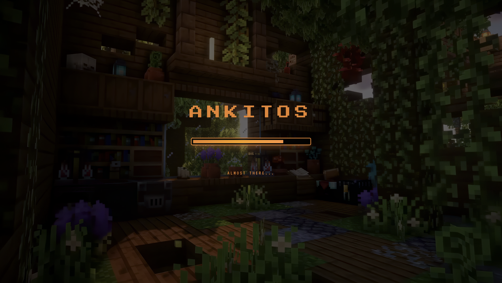
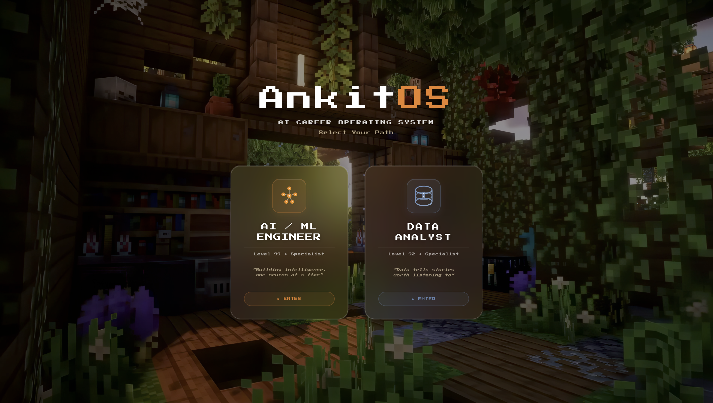
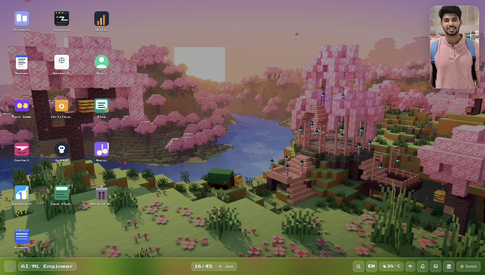
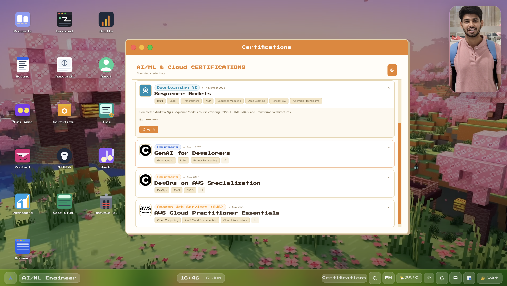
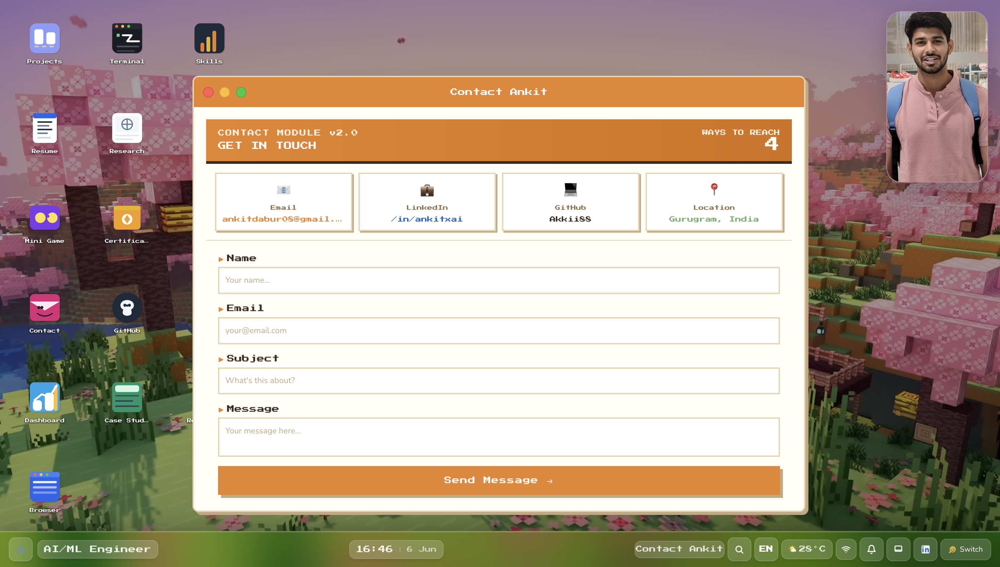
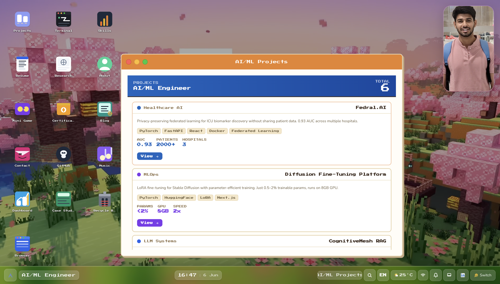
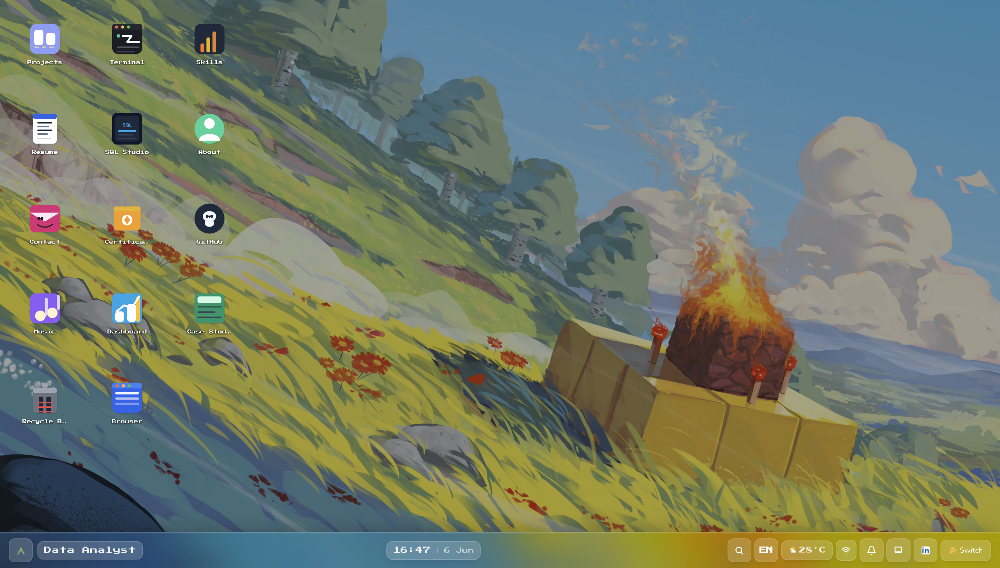
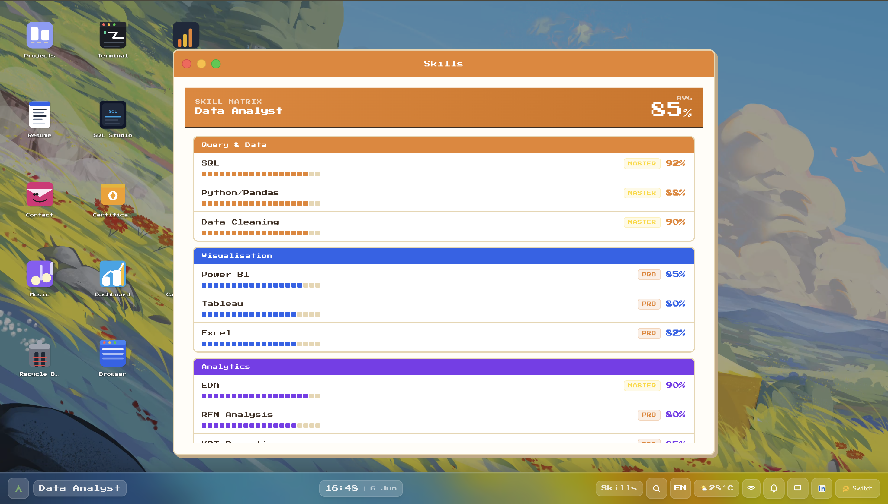
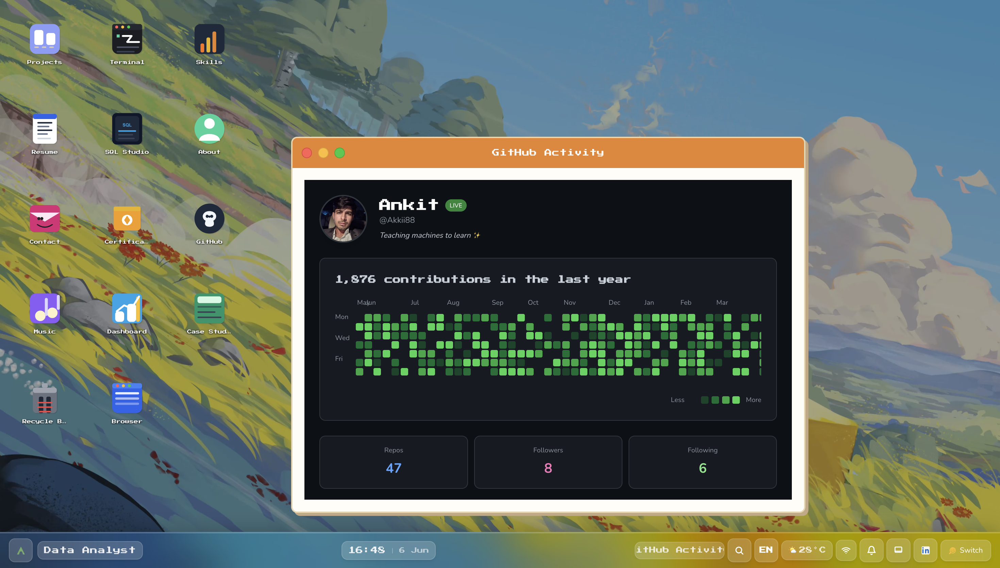

# AnkitOS

Interactive portfolio experience built as a desktop-like OS with boot/login phases, profile-based content (AI/ML vs Data Analyst), video wallpapers, draggable windows, and glassmorphism UI.











## Features

- **Boot Screen** - ASCII logo with progress bar and fade transition
- **Login Screen** - Glassmorphism/liquid glass design with quote rotation
- **Profile Selection** - AI/ML or Data Analyst views with unique wallpapers
- **Desktop Icons** - Flat SVG icons with click/double-click interactions
- **Window Management** - Draggable, resizable windows with smooth animations
- **Taskbar** - Full-width glassmorphism bar with system indicators
- **GitHub Activity** - Real GitHub stats display
- **Certifications** - Profile-specific certification windows
- **AI Assistant** - Video assistant (AI/ML profile only)

## Development

```bash
pnpm dev
```

## Tech Stack

- React + TypeScript
- Vite
- Tailwind CSS
- Glassmorphism UI design
